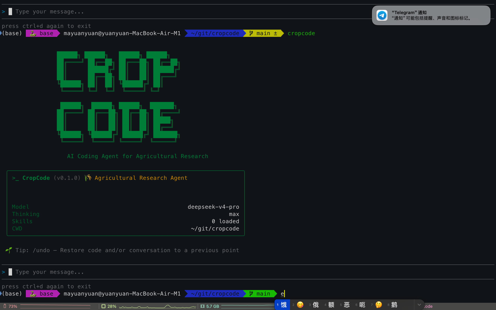

<div align="center">

<br/>

# 🌾 CropCode

**AI Coding Agent for Agricultural Research**

[](https://opensource.org/licenses/MIT)
[](https://nodejs.org/)
[](https://github.com/mayuanyuan/cropcode/pulls)

*An intelligent terminal coding assistant with deep thinking, tool use, and multi-turn reasoning — for data analysis, scripting, and scientific computing.*

[English](#english) · [中文](#中文)

</div>

---

<a id="english"></a>

## ✨ Highlights

- 🤖 **AI Agent** — Autonomous coding agent with deep thinking, tool use (bash, read, write, edit, web search), and multi-turn reasoning
- 🧠 **Deep Reasoning** — Powered by DeepSeek V4 with configurable thinking mode and reasoning effort control
- 🌱 **Data Analysis** — Native Python (pandas/numpy/scipy/matplotlib) and R integration for data processing and statistical computing
- 📄 **Paper Tools** — LaTeX typesetting, reference management, and figure generation
- 🔌 **MCP Integration** — Connect external tools via Model Context Protocol (GitHub, browser, databases, and more)
- 🎯 **Skills System** — Extensible skill architecture for custom domain knowledge and workflows
- 💬 **Multi-Session** — Session management with undo, resume, and conversation compaction

## 📸 Screenshot

<div align="center">
  
</div>

## 🎬 Demo

<div align="center">
  
</div>

## 🚀 Quick Start

### Install

```bash
git clone https://github.com/mayuanyuan/cropcode.git
cd cropcode
npm install
npm link
```

### Configure

Copy a settings template and fill in your API key:

```bash
# DeepSeek (recommended)
cp templates/settings/settings.json ~/.cropcode/settings.json

# or OpenAI
cp templates/settings/settings-openai.json ~/.cropcode/settings.json
```

Edit `~/.cropcode/settings.json` and replace the API key:

```json
{
  "env": {
    "MODEL": "deepseek-v4-pro",
    "BASE_URL": "https://api.deepseek.com",
    "API_KEY": "sk-your-api-key"
  },
  "thinkingEnabled": true,
  "reasoningEffort": "max"
}
```

### Run

```bash
cd your-project
cropcode
```

## 🌿 Core Features

### Data Analysis

CropCode handles data analysis natively with Python and R integration.

```
> 分析这个CSV数据，做统计摘要并绘制分布图
```

- Data cleaning, transformation, and visualization
- Python (pandas/numpy/scipy/matplotlib) + R
- Statistical modeling, regression, ANOVA

### Paper & Writing Tools

```
> 把这个结果整理成 LaTeX 表格
```

- LaTeX typesetting and reference management
- Figure and chart generation
- Data visualization for publications

### Agent Capabilities

```
> 读取 data/results.csv，清洗异常值，做统计分析，把结果写成 markdown 报告
```

CropCode operates as a fully autonomous agent:
1. Reads your files
2. Executes analysis code (Python/R/Shell)
3. Writes results and reports
4. Handles errors and retries automatically

### Skills & Plugin Marketplace

CropCode's skill system is fully extensible. You have multiple ways to find and install skills:

**Quick Start — Install from a community marketplace:**

```bash
# Register a marketplace (e.g. nature-skills)
cropcode marketplace add https://github.com/Yuan1z0825/nature-skills.git

# Browse available skills
cropcode marketplace list

# Install a skill
cropcode plugin install <skill-name>@nature-skills
```

**Other ways to get skills:**

| Method | How |
|--------|-----|
| Community marketplaces | `cropcode marketplace add <github-url>` — browse and install curated skill collections |
| Write your own | Create `~/.agents/skills/my-skill/SKILL.md` — no installation needed |
| Per-project skills | Place in `<project>/.agents/skills/` — available only in that project |
| Local directory | `cropcode marketplace add /path/to/skills` — use a local folder as marketplace |
| Git clone | Clone any skill repo and register it as a local marketplace |

Type `/` in the prompt to see all available skills, or `/marketplace` to manage marketplaces.

> **Full documentation:** [docs/plugins-skills-marketplace_en.md](docs/plugins-skills-marketplace_en.md) — includes how to create your own marketplace, write custom skills, and share with your team.

### MCP Integration

Connect external services via Model Context Protocol:

```json
{
  "mcpServers": {
    "github": {
      "command": "npx",
      "args": ["-y", "@modelcontextprotocol/server-github"],
      "env": {
        "GITHUB_PERSONAL_ACCESS_TOKEN": "ghp_..."
      }
    }
  }
}
```

See [docs/mcp_en.md](docs/mcp_en.md) for detailed setup.

## ⌨️ Keyboard Shortcuts

| Action | Key |
|--------|-----|
| Send message | `Enter` |
| New line | `Shift+Enter` |
| Interrupt generation | `Esc` |
| Command menu | `/` |
| Switch model | `/model` |
| List skills | `/skills` |
| Marketplace | `/marketplace` |
| Installed plugins | `/plugin` |
| New session | `/new` |
| Resume session | `/resume` |
| Undo | `/undo` |
| MCP status | `/mcp` |
| Exit | `/exit` or `Ctrl+D` ×2 |

## ⚙️ Configuration

### Configuration Hierarchy

Settings are resolved with the following priority (higher overrides lower):

1. **Defaults** — Hardcoded defaults
2. **User settings** — `~/.cropcode/settings.json`
3. **Project settings** — `<project>/.cropcode/settings.json`
4. **Environment variables** — `CROPCODE_*` prefixed env vars

### All Settings

| Field | Type | Description |
|-------|------|-------------|
| `env.MODEL` | string | Model name (e.g. `deepseek-v4-pro`, `gpt-4o`) |
| `env.BASE_URL` | string | API base URL |
| `env.API_KEY` | string | API key |
| `thinkingEnabled` | boolean | Enable thinking mode (default: `true` for DeepSeek V4) |
| `reasoningEffort` | string | `"max"` or `"high"` (default: `"max"`) |
| `notify` | string | Path to notification script |
| `webSearchTool` | string | Path to custom web search script |
| `mcpServers` | object | MCP server configurations |
| `disabledSkills` | string[] | Skills to disable |

For detailed configuration, see [docs/configuration_en.md](docs/configuration_en.md).

### Supported Models

Any OpenAI-compatible API can be used:

| Provider | `BASE_URL` | Example Models |
|----------|-----------|----------------|
| DeepSeek | `https://api.deepseek.com` | `deepseek-v4-pro`, `deepseek-v4-flash` |
| OpenAI | `https://api.openai.com/v1` | `gpt-4o`, `o3` |

## 🛠️ Architecture

```
┌─────────────────────────────────────────┐
│              Terminal UI (Ink/React)     │
├─────────────────────────────────────────┤
│           Session Manager                │
│  ┌────────────┐  ┌──────────────────┐   │
│  │ LLM Client │  │  Tool Executor   │   │
│  │ (OpenAI)   │  │  ┌────┐ ┌─────┐  │   │
│  │            │  │  │Bash│ │Read │  │   │
│  │ DeepSeek   │  │  ├────┤ ├─────┤  │   │
│  │ OpenAI     │  │  │Write│ │Edit │  │   │
│  │ ...        │  │  ├────┤ ├─────┤  │   │
│  │            │  │  │WebSearch│Ask │  │   │
│  └────────────┘  │  └─────────┴────┘  │   │
│                  │  ┌──────────────┐   │   │
│                  │  │  MCP Manager │   │   │
│                  │  └──────────────┘   │   │
│                  └──────────────────┘   │
├─────────────────────────────────────────┤
│          Skills & Prompts               │
│   ~/.agents/skills/*/SKILL.md           │
│   ./.agents/skills/*/SKILL.md           │
└─────────────────────────────────────────┘
```

## 🤝 Contributing

Contributions are welcome! Whether it's bug fixes, new features, skills, or documentation improvements.

1. Fork the repository
2. Create your feature branch: `git checkout -b feature/my-feature`
3. Commit your changes: `git commit -m 'feat: add some feature'`
4. Push to the branch: `git push origin feature/my-feature`
5. Open a Pull Request

## 📄 License

[MIT](LICENSE) © CropCode Contributors

---

<a id="中文"></a>

<div align="center">

# 🌾 CropCode

**专为农业科研设计的 AI 编程助手**

*具备深度思考、工具调用和多轮推理能力的智能终端编程助手，适用于数据分析、脚本编写和科学计算。*

</div>

## ✨ 核心特性

- 🤖 **自主 Agent** — 具备深度思考、工具调用（bash/read/write/edit/web search）和多轮推理能力的自主编程助手
- 🧠 **深度推理** — 基于 DeepSeek V4，支持思考模式和推理强度控制
- 🌱 **数据分析** — 原生 Python (pandas/numpy/scipy/matplotlib) 和 R 集成，支持数据处理和统计计算
- 📄 **论文工具** — LaTeX 排版、参考文献管理、图表生成
- 🔌 **MCP 集成** — 通过 Model Context Protocol 连接外部工具（GitHub、浏览器、数据库等）
- 🎯 **技能系统** — 可扩展的技能架构，支持自定义领域知识和工作流
- 💬 **多会话管理** — 支持撤销、恢复和对话压缩

## 🚀 快速开始

### 安装

```bash
git clone https://github.com/mayuanyuan/cropcode.git
cd cropcode
npm install
npm link
```

### 配置

复制配置模板并填入你的 API Key：

```bash
# DeepSeek（推荐）
cp templates/settings/settings.json ~/.cropcode/settings.json

# 或 OpenAI
cp templates/settings/settings-openai.json ~/.cropcode/settings.json
```

编辑 `~/.cropcode/settings.json`，替换 API Key：

```json
{
  "env": {
    "MODEL": "deepseek-v4-pro",
    "BASE_URL": "https://api.deepseek.com",
    "API_KEY": "sk-你的API密钥"
  },
  "thinkingEnabled": true,
  "reasoningEffort": "max"
}
```

### 运行

```bash
cd your-project
cropcode
```

## 🌿 功能详解

### 数据分析

CropCode 原生支持数据清洗、统计分析和可视化。

```
> 分析这个CSV数据，做统计摘要并绘制分布图
```

### 论文写作工具

```
> 把这个结果整理成 LaTeX 表格
```

### 技能与插件市场

CropCode 的技能系统完全可扩展，你可以自由选择获取和管理技能的方式：

**快速开始 — 从社区市场安装：**

```bash
# 注册一个市场（例如 nature-skills）
cropcode marketplace add https://github.com/Yuan1z0825/nature-skills.git

# 浏览可用技能
cropcode marketplace list

# 安装技能
cropcode plugin install <技能名>@nature-skills
```

**其他获取技能的方式：**

| 方式 | 操作 |
|------|------|
| 社区市场 | `cropcode marketplace add <github地址>` — 浏览并安装精选技能集合 |
| 自己编写 | 在 `~/.agents/skills/我的技能/SKILL.md` 创建即可，无需安装 |
| 项目级技能 | 放在 `<项目>/.agents/skills/` 下，仅当前项目可用 |
| 本地目录 | `cropcode marketplace add /路径/技能目录` — 用本地文件夹作为市场 |
| Git 克隆 | 克隆任意技能仓库，注册为本地市场即可使用 |

在提示符中输入 `/` 查看所有可用技能，或输入 `/marketplace` 管理市场。

> **完整文档：** [docs/plugins-skills-marketplace.md](docs/plugins-skills-marketplace.md) — 包含如何创建自己的市场、编写自定义技能、以及与团队共享。[English](docs/plugins-skills-marketplace_en.md)

### MCP 集成

通过 Model Context Protocol 连接 GitHub 等外部服务：

```json
{
  "mcpServers": {
    "github": {
      "command": "npx",
      "args": ["-y", "@modelcontextprotocol/server-github"],
      "env": {
        "GITHUB_PERSONAL_ACCESS_TOKEN": "ghp_..."
      }
    }
  }
}
```

详见 [docs/mcp.md](docs/mcp.md)。

## ⌨️ 快捷键

| 操作 | 按键 |
|------|------|
| 发送消息 | `Enter` |
| 换行 | `Shift+Enter` |
| 中断生成 | `Esc` |
| 命令菜单 | `/` |
| 切换模型 | `/model` |
| 查看技能 | `/skills` |
| 插件市场 | `/marketplace` |
| 已装插件 | `/plugin` |
| 新会话 | `/new` |
| 恢复会话 | `/resume` |
| 撤销 | `/undo` |
| MCP 状态 | `/mcp` |
| 退出 | `/exit` 或 `Ctrl+D` ×2 |

## ⚙️ 配置

### 配置层级

设置按以下优先级解析（高优先级覆盖低优先级）：

1. **默认值** — 程序内置
2. **用户配置** — `~/.cropcode/settings.json`
3. **项目配置** — `<项目>/.cropcode/settings.json`
4. **环境变量** — `CROPCODE_*` 前缀的环境变量

详细配置说明请参阅 [docs/configuration.md](docs/configuration.md)。

## 🛠️ 致谢

本项目开发过程中参考和使用了以下开源技术：

- [DeepSeek](https://deepseek.com) — LLM 模型服务
- [OpenAI Node.js SDK](https://github.com/openai/openai-node) — LLM API 调用
- [Ink](https://github.com/vadimdemedes/ink) — 终端 React 渲染引擎
- [MCP](https://modelcontextprotocol.io/) — AI 工具集成协议
- [esbuild](https://esbuild.github.io/) — JavaScript 构建工具
- [React](https://react.dev/) — UI 框架

## 📄 许可证

[MIT](LICENSE) © CropCode Contributors
