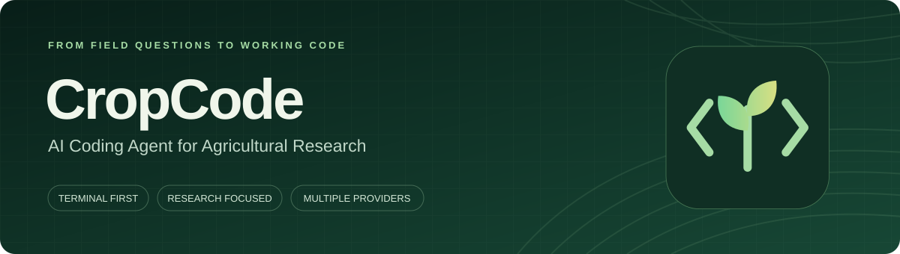

<p align="center">
  
</p>

<h1 align="center">CropCode 🌱</h1>

<p align="center">
  <strong>把田间问题，带进代码。让科研过程，有迹可循。</strong><br>
  面向农业科研的终端 AI 编程助手
</p>

<p align="center">
  <a href="https://github.com/YuanyuanMa03/cropcode/releases"></a>
  <a href="package.json"></a>
  <a href="LICENSE"></a>
</p>

<p align="center">
  <a href="#快速开始">快速开始</a> ·
  <a href="#一次任务如何完成">交互演示</a> ·
  <a href="docs/quickstart.md">使用指南</a> ·
  <a href="docs/providers.md">模型接入</a> ·
  <a href="README-en.md">English</a>
</p>

---

CropCode 在你的项目目录里工作：读取数据和代码、讨论分析方案、编写 Python/R 脚本、运行命令，并把执行过程呈现在终端中。从田间试验到遥感处理，从作物模型到日常开发，都可以从一句自然语言任务开始。

| 🌾 懂科研语境 | 🖥️ 在项目里动手 | 🔌 自由选择模型 |
| --- | --- | --- |
| 农业领域提示词关注单位、试验设计、数据来源与可复现性 | 绿色终端界面，直接读写文件、执行命令、查看工具输出 | 内置 DeepSeek、智谱 GLM、通义千问、MiMo、LongCat 接入配置 |

## 看看它如何工作

<a href="docs/assets/cropcode-terminal.png">
  
</a>

<p align="center"><sub>实机截图 · 欢迎界面与自我介绍过程 · 点击查看 3840 × 2160 原图</sub></p>

这张截图展示了一个具体过程：**输入问题 → 加载 `cropcode-self-refer` 技能 → 读取随包文档 → 开始回答**。欢迎面板显示当前供应商、模型、思考设置和工作目录。背景壁纸与透明效果来自截图中的终端配置。

## 快速开始

选择适合你的安装方式。两种方式都需要所选模型服务的 API Key。

| 安装方式 | 适合谁 | 是否需要预装 Node.js |
| --- | --- | --- |
| **独立安装包**（curl / PowerShell） | 希望直接使用的用户 | **不需要**，包内附带私有运行环境与依赖 |
| **npm** | 已有 Node.js 开发环境的用户 | 需要 Node.js 22+ 和 npm |

### 一键安装：无需 Node.js

**macOS / Linux / WSL：**

```bash
curl -fsSL https://raw.githubusercontent.com/YuanyuanMa03/cropcode/main/install.sh | sh
```

**Windows PowerShell：**

```powershell
irm https://raw.githubusercontent.com/YuanyuanMa03/cropcode/main/install.ps1 | iex
```

安装器自动选择最新稳定版和当前系统架构，校验 SHA-256 后安装。macOS/Linux 默认目录为 `~/.local/share/cropcode`，命令位于 `~/.local/bin/cropcode`；Windows 默认目录为 `%LOCALAPPDATA%\CropCode`，命令位于其中的 `bin`。根据安装器提示设置 PATH，重新打开终端后运行：

```bash
cropcode
```

无需管理员权限，不覆盖系统 Node.js。重新执行安装命令即可更新；新包验证成功后才会切换入口，下载或校验失败时保留原版本。历史安装目录保留至卸载，以免影响仍在运行的会话。

**平台范围：** macOS 13.5+（Intel / Apple Silicon）、glibc 2.28+ 的 Linux（x64 / ARM64，含 WSL2）、Windows 10+（x64 / ARM64）。Alpine/musl 暂不提供独立包，可使用符合依赖要求的 Node.js 与 npm 安装。原生 Windows 的 Shell 工具还需要 Git for Windows 提供 Bash。

### npm 安装

```bash
npm install -g https://github.com/YuanyuanMa03/cropcode/releases/download/v1.1.0/cropcode-cli-1.1.0.tgz
cropcode
```

此方式使用系统 Node.js 和 npm 全局目录，安装时联网获取对应平台的依赖。安装来源为 GitHub Release `.tgz`。

### 本地开发：npm link

```bash
git clone https://github.com/YuanyuanMa03/cropcode.git
cd cropcode
npm ci
npm run link:local
cropcode --version
```

`npm run link:local` 构建项目并执行 `npm link --workspace=@yuanyuanma03/cropcode-cli`。修改源码后运行 `npm run build` 并重新启动，保留源码目录，无需重复链接。[本地开发与 PATH 说明 →](docs/installation.md)

进入研究项目目录运行 `cropcode`。首次启动通过 **供应商 → 接入方式 → 模型 → API Key** 完成配置；已有配置直接复用，也可使用 `/login` 重新选择。

## Desktop 与本地 Web 工作台

任务侧栏、历史搜索、项目文件引用和对话工作区，支持实时回复、工具输出、Plan 模式和权限确认。Desktop 与浏览器共用界面，复用终端的模型配置与农业科研能力。

从源码构建后，运行 `npm run dev --workspace=cropcode-desktop` 启动桌面端；macOS 使用原生窗口控件，支持跟随系统的浅色与深色外观。


安装 `1.1.0` 或从当前源码完成上面的 `npm run link:local` 后，在你的项目目录运行：

```bash
cropcode web
# 自定义端口
cropcode web --port 8788
```

打开终端打印的完整地址，默认端口为 `8787`，仅监听本机 `127.0.0.1`。首次使用请先运行 `cropcode` 配置模型；在服务终端按 `Ctrl+C` 停止。[Web 使用说明 →](docs/web.md)

## 更新与卸载

**更新独立安装版：** 重新执行上方 curl 或 PowerShell 命令。指定版本、自定义目录和多安装切换见[安装指南](docs/installation.md)。

**卸载 curl 安装版：**

```bash
sh "$HOME/.local/share/cropcode/uninstall.sh"
```

**卸载 Windows 独立安装版：**

```powershell
powershell -NoProfile -ExecutionPolicy Bypass -File "$env:LOCALAPPDATA\CropCode\uninstall.ps1"
```

**卸载 npm 安装版或解除默认全局目录中的开发链接：**

```bash
npm uninstall -g @yuanyuanma03/cropcode-cli
```

卸载独立安装版会移除该安装的程序、历史版本和私有运行环境；所有方式均保留 `~/.cropcode` 中的 API 配置、会话及项目文件。卸载前退出正在运行的 CropCode。使用过自定义目录，或从旧版 npm 包装式 curl 安装迁移时，请按[对应卸载步骤](docs/installation.md#卸载)操作。

## 一次任务如何完成

以“分析田间试验数据”为例，下面是可以照着操作的交互流程。**提示词和文件名是使用示例，需替换成你的真实数据；不是已完成的实验结果。**

```text
进入项目 → 选择模型 → 讨论方案 → 确认执行 → 查看文件与运行结果
                         ↑                       │
                         └──── 补充条件，继续迭代 ──┘
```

**① 把任务与数据一起交给它**

在输入框中使用 `@` 引用文件，也可以直接描述项目中的数据位置：

```text
检查 @data/field_trial.csv 的字段、缺失值、产量单位与区组结构。
先列出需要我确认的问题，不要修改原始数据，也不要推测缺失的单位。
```

**② 先讨论分析方案**

输入 `/plan` 或按 `Shift+Tab` 进入规划模式，再说明目标：

```text
根据刚才核实的试验设计，规划一套 R 分析流程。
说明模型选择依据、诊断方法、图表和输出文件，先不要实施。
```

**③ 确认后开始实施**

完整方案输出后，界面会出现 `Plan ready` 选择框。选择 **`implement this plan`** 开始执行；还想调整时，选择 **`stay in Plan mode`**。执行过程中可以查看文件读取、编辑与命令输出；权限规则要求确认时，界面会显示相应提示。

**④ 用实际产物验收，再继续迭代**

```text
运行分析脚本，并汇总输出文件、实际运行命令和检查结果。
原始数据保持不变；依赖缺失、运行失败或尚未验证的部分请明确列出。
```

检查生成的脚本、表格和图像后，可继续要求修改。按 `Esc` 中断当前生成；下次通过 `/resume` 继续会话，或用 `/undo` 选择恢复文件和/或对话检查点。

[查看完整操作指南 →](docs/quickstart.md)

## 带着你的研究问题开始

以下是任务示例；执行需要你提供真实数据、相应运行环境和必要的外部工具。

| 场景 | 可以交给 CropCode 的任务 | 可要求交付的产物 |
| --- | --- | --- |
| **田间试验与统计** | 核查缺失值、重复观测和区组结构，编写与试验设计匹配的分析代码 | 数据检查清单、R/Python 脚本、统计表 |
| **遥感与空间分析** | 检查波段、坐标系、缩放系数与云掩膜，编写植被指数及区域统计流程 | 批处理脚本、栅格结果、质量检查记录 |
| **作物模型与参数分析** | 整理模型输入、编写批量运行与参数敏感性分析脚本 | 输入检查脚本、运行配置、结果比较图 |
| **科研绘图与复现** | 按指定单位、分组和图例绘图，整理环境依赖与运行步骤 | 绘图代码、图像文件、复现说明 |
| **日常软件开发** | 阅读仓库、定位问题、修改代码并运行相关测试 | 代码改动、测试输出、变更说明 |

<details>
<summary><strong>展开：两段可直接修改使用的科研提示词</strong></summary>

**遥感数据处理**

```text
检查 imagery/ 中的影像元数据，确认波段含义、坐标系和缩放系数。
如果缺少云掩膜或必要元数据，先告诉我。
编写 Python 脚本计算 NDVI，保留无效值掩膜，并记录输入文件和处理参数。
```

**科研图表复现**

```text
读取 results/ 中实际存在的结果文件，用 ggplot2 绘制处理组比较图。
误差线的定义先与我确认，不从汇总均值反推原始重复。
将绘图脚本、图像与运行步骤分别保存，列出本次实际执行的命令。
```

</details>

农业科研提示词要求核对数据来源、单位、时间、坐标系和试验设计，标注模拟数据，避免编造文献与实验结果。这些是对模型的工作要求，科学结论仍需结合数据与方法审查。DSSAT、APSIM、WOFOST、气象数据库及实验数据需要在实际项目中提供。

## 用得顺手，也能接着做

| 能力 | 在工作中怎么用 |
| --- | --- |
| **文件与 Shell 工具** | 在当前项目中读取、创建和编辑文件，运行前台或后台命令 |
| **Plan Mode 与权限** | 先讨论方案，再选择实施；按作用域配置允许、询问或拒绝的操作 |
| **会话与检查点** | 用 `/resume` 接着做、`/fork` 分叉讨论、`/undo` 恢复已跟踪文件或对话 |
| **Skills 与项目说明** | 将重复流程整理成技能，通过 `/init` 生成项目说明，用 `/skills` 查看可用技能 |
| **MCP 外部工具** | 配置外部工具服务，再用 `/mcp` 检查连接与工具列表 |
| **长任务与自动化** | 流式输出、请求重试、上下文压缩，以及非交互单次执行 |
| **图片与编辑器** | 配置多模态模型读取图片；仓库同时提供共享核心库的 VSCode 扩展 |

常用入口：`/login` 选供应商 · `/model` 选模型与思考设置 · `/plan` 规划 · `/new` 新会话 · `/raw` 调整显示 · `/exit` 退出。

脚本或自动化任务可使用：

```bash
cropcode --exec --prompt "总结当前项目的目录结构与测试入口，不修改文件。"
cropcode --help
```

非交互模式不能回答追问或权限确认；需要交互时，应回到终端会话处理。联网搜索使用配置的 `webSearchTool` 脚本，或 DeepSeek 官方 API 连接下的内置搜索能力；图片理解取决于当前模型的多模态支持。

## 模型由你选择

内置接入配置覆盖以下五家供应商，也可以在配置文件中设置兼容的 API 地址与模型 ID。

| 供应商 | 客户端内置接入方式 |
| --- | --- |
| DeepSeek | API |
| 智谱 GLM | API / Coding Plan |
| 通义千问 Qwen | API / Coding Plan |
| MiMo 小米 | API / Token Plan |
| LongCat | API |

`/login` 管理供应商与接入方式；`/model` 调整模型、思考开关及支持的推理强度。模型列表会尝试从当前连接的 `/models` 接口获取，失败时保留预设与当前模型。实际可用模型、套餐权限和价格以供应商账户为准。

配置优先级：**`CROPCODE_*` 环境变量 → 项目配置 → 用户配置 → 登录凭证 → 默认值**。切换后配置未生效时，先检查更高优先级的覆盖项。[接入与配置详情 →](docs/providers.md)

## 文档导航

| 我想…… | 从这里开始 |
| --- | --- |
| 完成第一次交互、查快捷键与命令 | [使用指南](docs/quickstart.md) |
| 设置模型、图片支持与搜索 | [配置说明](docs/configuration.md) · [模型供应商](docs/providers.md) |
| 先规划，再执行 | [Plan Mode](docs/plan-mode.md) |
| 调整文件与命令执行权限 | [权限配置](docs/permission.md) |
| 恢复会话、分叉与撤销 | [会话与检查点](docs/session-persistence.md) |
| 保存项目约定、复用工作流、接外部工具 | [AGENTS.md](docs/agents-md.md) · [Skills](docs/agent-skills.md) · [MCP](docs/mcp.md) |
| 了解代码结构或版本变化 | [架构说明](docs/architecture.md) · [更新记录](CHANGELOG.md) |

## 参与开发

新工作台已接入真实会话内核，`npm run build` 后通过 `cropcode web` 或桌面薄壳启动。独立设计演示保留在 `?preview=1`；详情见[工作台与设计预览](docs/workbench-preview.md)。

```bash
npm ci
npm run check        # 类型、lint 和格式检查
npm test             # core / CLI / VSCode 测试
npm run build        # core + CLI
npm run build:vscode # VSCode 扩展
npm run package:cli  # CLI 发布包，输出到 release/
```

`packages/core` 管理会话与工具，`packages/cli` 提供终端界面，`packages/vscode-ide-companion` 提供编辑器界面。欢迎通过 [Issues](https://github.com/YuanyuanMa03/cropcode/issues) 提交问题与建议；报告问题时请附版本、运行环境、复现步骤及脱敏后的输出。

## 致谢

CropCode 的实现建立在 TypeScript、Node.js、React、Ink、OpenAI JavaScript SDK、Model Context Protocol、Sharp、Yargs 等开源技术之上，并兼容多家模型服务的 API。感谢这些项目的维护者与开源社区；各依赖的许可信息以依赖包和锁文件记录为准。

## 许可证

采用 [MIT 许可证](LICENSE)，包含第三方 MIT 许可代码，必要版权声明予以保留。
