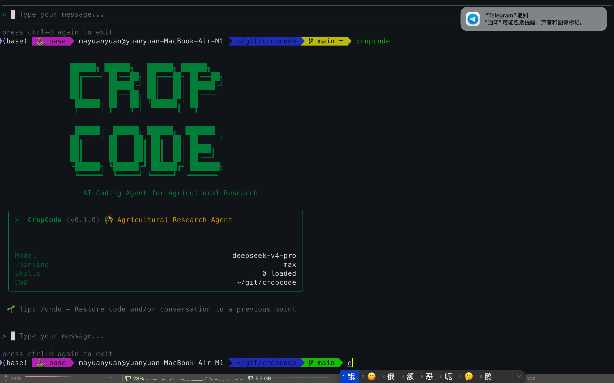

<div align="center">



# CropCode

**开源 · 多供应商 · 终端原生 AI 编程代理**

[](https://opensource.org/licenses/MIT)
[](https://nodejs.org/)
[](https://github.com/YuanyuanMa03/cropcode/actions/workflows/ci.yml)
[](https://github.com/YuanyuanMa03/cropcode/pulls)

工具执行 · 权限门控 · 上下文压缩 · Hooks · MCP · 技能市场
DeepSeek / 智谱 GLM / 通义千问 / 小米 MiMo · 国内直连 · MIT 许可

[English](README_en.md) · [系统架构](docs/architecture.md) · [配置手册](docs/configuration.md) · [技能市场](docs/marketplace-guide.md)

</div>

---

## 它是什么

CropCode 是一个运行在终端里的 AI 编程代理。它把大模型接入一个完整的工具执行环境——Shell、文件读写、检索、联网搜索、权限确认——让模型在你的项目里自主完成多步骤工程任务：读代码、改代码、跑测试、修错误、写报告。

与同类商业产品（Claude Code、Codex CLI）相比，CropCode 的差异在于三点：

- **开源（MIT）**：agent 循环、工具执行、上下文管理全部自研实现，无闭源黑盒，可审计、可修改、可自托管
- **供应商自由**：四家 OpenAI 兼容供应商（DeepSeek、智谱 GLM、通义千问、小米 MiMo）一套界面自由切换，支持按量计费与订阅套餐两种接入方式，国内直连无需代理
- **社区技能市场**：技能以 `SKILL.md` 标准格式分发，可从任意 Git 仓库安装，输入 prompt 时按意图自动激活

项目的初始场景是农业科研的数据分析与论文写作（Python/R/LaTeX 工作流），但作为通用 agent harness，它同样适用于日常的软件工程任务。

## 关键能力

| 能力 | 说明 |
|------|------|
| **Agent 循环** | 流式推理 + 工具调用 + 多轮自主执行；thinking 内容独立渲染，`/raw` 切换原始视图 |
| **工具系统** | 9 个内置工具（Bash、Read、Write、Edit、Grep、Glob、WebSearch、AskUserQuestion、UpdatePlan），MCP 服务器工具动态注入 |
| **权限系统** | 按工具作用域（命令 / 文件路径 / 网络）门控，四种默认模式（默认询问 → 全部允许等），会话内记住授权决定 |
| **上下文工程** | 三级自动压缩（auto-compact / microcompact / reactive compact）+ 断路器，长会话不失控 |
| **会话管理** | 持久化、多会话、`/resume` 恢复、检查点 `/undo` 回滚代码与会话 |
| **Hooks** | 工具调用前后触发自定义 shell 命令，支持 matcher 匹配规则，可拦截与改写 |
| **技能与市场** | 用户级 / 项目级 / 社区市场三种技能来源，`marketplace add` + `plugin install` 一条命令安装 |
| **深度推理适配** | 自动处理 deepseek / qwen 两种 thinking 协议差异（reasoning_effort ↔ thinking_budget 映射、reasoning_content 回放） |
| **自更新** | GitHub Releases 清单检查、sha256 校验、版本化安装、`cropcode rollback` 一键回退 |
| **多供应商登录** | TUI 交互式向导：选供应商 → 选模型 → 输入密钥，零配置文件 |

## 安装

**一键安装**（发布包内置 Node.js 运行时，无需预装）：

```powershell
# Windows PowerShell
irm https://raw.githubusercontent.com/YuanyuanMa03/cropcode/main/install.ps1 | iex
```

```bash
# macOS / Linux
curl -fsSL https://raw.githubusercontent.com/YuanyuanMa03/cropcode/main/install.sh | sh
```

**手动安装**：从 [GitHub Releases](https://github.com/YuanyuanMa03/cropcode/releases) 下载对应平台的压缩包——

- Windows x64：解压 ZIP，双击 `install.cmd`（或直接运行 `cropcode.cmd` 免安装）
- macOS（Apple Silicon / Intel）：解压 TAR.GZ，运行 `./install.sh`
- Linux x64：解压 TAR.GZ，运行 `./install.sh`

**从源码构建**（需要 Node.js >= 22）：

```bash
git clone https://github.com/YuanyuanMa03/cropcode.git
cd cropcode
npm install
npm run build
npm link
```

## 快速上手

进入你的项目目录，启动：

```bash
cropcode
```

首次启动进入交互式登录向导，三步完成：选择供应商 → 选择模型 → 输入 API 密钥。

```
 选择供应商
 ─────────────────────────────────────
 ▶ DeepSeek            按量计费
   智谱 GLM            Coding Plan
   通义千问             Coding Plan
   MiMo 小米            Token Plan

 ↑↓ 选择 · Enter 确认
```

之后直接用自然语言下任务：

```
> 读取 src/ 下所有 TypeScript 文件，找出缺少类型注解的函数，
  补上类型，然后运行测试套件并汇报结果
```

CropCode 会自主完成：检索代码 → 定位问题 → 编辑文件 → 执行测试 → 报告结果，危险操作弹出权限确认。

切换模型或供应商随时可用 `/model`、`/login`，无需重启。

## 供应商

四家供应商均为 OpenAI 兼容 API，协议差异（thinking 格式、reasoning effort、流式解析）由 CropCode 自动处理。

| 供应商 | 模型 | 接入方式 | Thinking 协议 |
|--------|------|----------|---------------|
| **DeepSeek** | V4 Pro · V4 Flash | API Key 按量计费 | deepseek 格式 + reasoning_effort |
| **智谱 GLM** | GLM-5.2 · 5.1 · 4.7 · 4.6 · 4.7 Flash · 4 Flash | API Key / Coding Plan（Lite / Pro / Max） | deepseek 格式 + reasoning_effort |
| **通义千问** | Qwen3.7 Max · Plus · Turbo · Qwen3 Max | API Key / Coding Plan（Pro） | qwen 格式（thinking_budget） |
| **小米 MiMo** | V2.5 Pro · V2.5 | Token Plan（Lite / Standard / Pro / Max） | deepseek 格式 |

各供应商的定价、试用额度以官方页面为准：[DeepSeek](https://platform.deepseek.com) · [智谱](https://open.bigmodel.cn) · [通义千问](https://bailian.console.aliyun.com) · [MiMo](https://platform.xiaomimimo.com)。

## 系统架构

npm workspaces monorepo，核心与界面分层解耦：

```
┌─ CLI · Ink/React 终端界面 ────────────────────────────
│  登录向导 · 流式渲染 · 权限确认 · 斜杠命令 · 会话列表
├─ SessionManager（核心编排）──────────────────────────
│  上下文组装与压缩（auto / micro / reactive + 断路器）
│  检查点与撤销 · 会话持久化 · 恢复
├─ 工具执行引擎 ────────────────────────────────────────
│  Bash · Read · Write · Edit · Grep · Glob
│  WebSearch · AskUserQuestion · UpdatePlan
│  权限门控 · Hooks · MCP 外部工具动态注入
├─ LLM 客户端 ──────────────────────────────────────────
│  OpenAI 兼容协议 · thinking 双协议适配 · 流式解析
├─ 扩展层 ──────────────────────────────────────────────
│  Skills · Plugins · 社区市场 · 自更新（sha256 校验 + 回滚）
└──────────────────────────────────────────────────────
```

- `packages/core`（`@YuanyuanMa03/cropcode-core`）— 无头核心库：会话、工具、权限、hooks、MCP、市场，不依赖 UI
- `packages/cli`（`@YuanyuanMa03/cropcode-cli`）— Ink/React 终端界面与 CLI 子命令

完整设计（数据流、模型解析、压缩策略、权限评估流程）见 [架构文档](docs/architecture.md)，另有交互式 [draw.io 架构图](docs/architecture-diagram.drawio)。

## 技能与市场

技能是带使用说明的知识包（`SKILL.md` + 可选脚本），三种来源：

```bash
# 注册社区市场（任意 Git 仓库或本地目录）
cropcode marketplace add https://github.com/Yuan1z0825/nature-skills.git

# 浏览并安装
cropcode marketplace list
cropcode plugin install <技能名>@nature-skills
```

| 来源 | 位置 |
|------|------|
| 社区市场 | `marketplace add <git-url 或本地路径>` 后安装 |
| 用户级 | `~/.agents/skills/<技能名>/SKILL.md` |
| 项目级 | `<项目>/.agents/skills/<技能名>/SKILL.md` |

详见[技能与插件市场文档](docs/plugins-skills-marketplace.md)与[市场指南](docs/marketplace-guide.md)。

## MCP 集成

通过 [Model Context Protocol](https://modelcontextprotocol.io/) 接入外部工具服务器：

```json
{
  "mcpServers": {
    "github": {
      "command": "npx",
      "args": ["-y", "@modelcontextprotocol/server-github"],
      "env": { "GITHUB_PERSONAL_ACCESS_TOKEN": "ghp_..." }
    }
  }
}
```

服务器工具注入模型工具列表，`/mcp` 查看连接状态。详见 [MCP 文档](docs/mcp.md)。

## 配置

优先级从高到低：

1. **凭证** — `credentials.json`（登录向导管理，存在即最高）
2. **环境变量** — `CROPCODE_*` 前缀
3. **项目配置** — `<项目>/.cropcode/settings.json`
4. **用户配置** — `~/.cropcode/settings.json`
5. **内置默认**

常用设置：

| 字段 | 类型 | 说明 |
|------|------|------|
| `thinkingEnabled` | boolean | 深度推理开关（默认按模型预设） |
| `reasoningEffort` | `"max"` \| `"high"` | 推理深度 |
| `mcpServers` | object | MCP 服务器配置 |
| `notify` | string | 通知脚本路径 |
| `webSearchTool` | string | 自定义搜索脚本路径 |
| `disabledSkills` | string[] | 禁用的技能列表 |
| `enabledSkills` | object | 按名称启用的技能开关（默认全部启用） |

模型与密钥通过 `/model`、`/login` 管理，通常无需手改配置。完整字段见[配置手册](docs/configuration.md)。

## 命令与快捷键

| 命令 | 说明 |
|------|------|
| `/model` | 切换模型、思考模式与推理强度 |
| `/login` | 重新进入登录向导 |
| `/new` | 开始新会话 |
| `/resume` | 浏览并恢复历史会话 |
| `/continue` | 继续当前会话或选择一个恢复 |
| `/undo` | 将代码和/或会话回滚到之前的检查点 |
| `/permissions` | 查看与切换权限模式 |
| `/init` | 生成 AGENTS.md 项目说明文件 |
| `/skills` | 列出可用技能 |
| `/marketplace` | 浏览与管理技能市场 |
| `/plugin` | 管理已安装插件 |
| `/mcp` | 查看 MCP 服务器状态与工具 |
| `/raw` | 切换推理内容的显示模式 |
| `/exit` | 退出 |

| 操作 | 按键 |
|------|------|
| 发送消息 | `Enter` |
| 换行 | `Shift+Enter` |
| 中断生成 | `Esc` |
| 命令菜单 | `/` |
| 退出 | `Ctrl+D` ×2 |

## 开发

```bash
npm install        # 安装依赖并链接工作区
npm run check      # typecheck + lint + 格式检查
npm run build      # core tsc → cli esbuild 打包
npm test           # 372 个测试（core 190 + cli 182）
```

CI 在 ubuntu / windows / macos × Node 20 / 22 / 24 的 9 任务矩阵上运行检查、构建与测试。

## 贡献

欢迎 issue 与 PR：bug 修复、新功能、技能包、文档改进都接受。提交遵循 [Conventional Commits](https://www.conventionalcommits.org/)。

1. Fork 并创建分支：`git checkout -b feat/my-feature`
2. 提交并通过 `npm run check` + `npm test`
3. 推送并创建 Pull Request

## 许可

[MIT](LICENSE) © CropCode Contributors

## 致谢

- [Claude Code](https://docs.anthropic.com/en/docs/claude-code) — 终端 AI 代理的产品标杆
- [DeepCode CLI](https://github.com/nicepkg/deepcode-cli) — 本项目在架构与实现模式上的重要参考
- [Ink](https://github.com/vadimdemedes/ink) · [esbuild](https://esbuild.github.io/) · [OpenAI Node.js SDK](https://github.com/openai/openai-node) · [MCP](https://modelcontextprotocol.io/)
