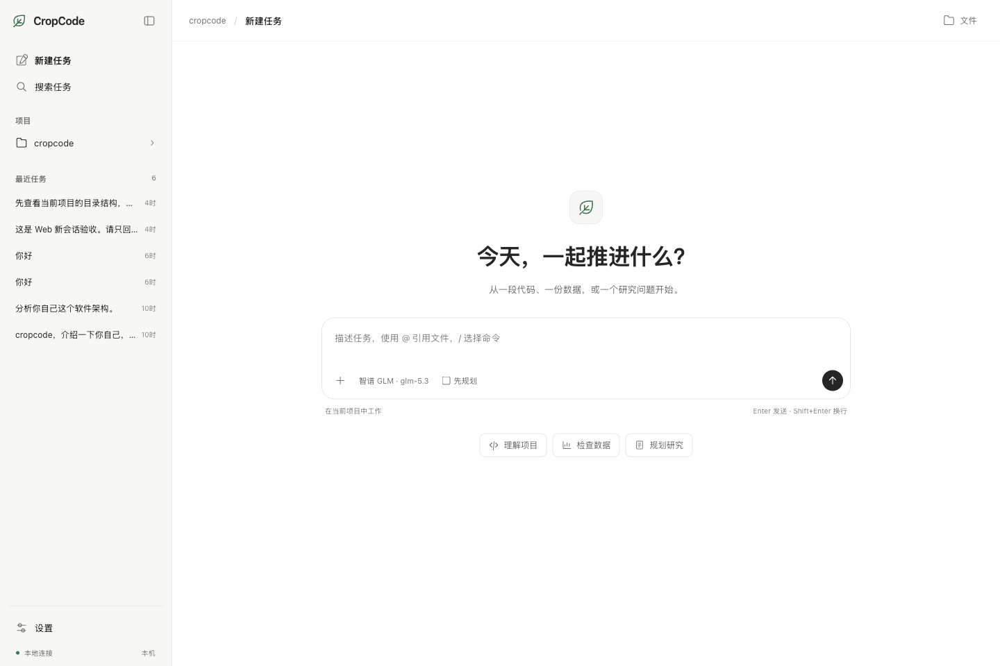

# Desktop 与本地 Web 工作台

`cropcode web` 自 1.1.0 起随 CLI 一同发布。

当前源码构建默认加载新工作台，功能与启动方式见[工作台与设计预览](workbench-preview.md)。下文的界面截图、按钮及快捷键说明对应保留在 `/legacy` 的旧版界面；已发布的旧安装包保持原有界面。

Desktop 与 Web 共用任务工作台，和终端使用同一个会话内核，复用已有供应商配置、农业科研提示词、工具、权限规则及本地历史。无需单独部署前端，也没有额外的 Web 服务依赖。



## 启动

从当前源码安装依赖并构建：

```bash
npm ci
npm run link:local
```

进入实际工作项目，先运行 `cropcode` 完成模型配置（已有配置可以直接复用），然后启动 Web：

```bash
cd /path/to/your/project
cropcode web
```

默认监听 `127.0.0.1:8787`。打开终端打印的**完整地址**，其中包含本次服务生成的本机访问凭证。端口占用时可改用：

```bash
cropcode web --port 8788
```

不使用全局链接时，可以在源码目录执行 `npm run build`、`npm start -- web --port 8787`；这种方式以源码目录作为工作项目。也可以在目标项目中运行 `node /absolute/path/to/cropcode/packages/cli/dist/cli.js web`。

Web 仅监听本机，不提供 `--host` 参数，不用于局域网共享或公网部署。手机尺寸适配用于窄窗口；手机无法通过电脑的 `127.0.0.1` 访问服务。独立安装包仍需在后续版本发布时完成各平台验证；Windows 的 Shell 工具继续依赖 Git for Windows 的 Bash。

## 桌面工作台

从源码启动 Electron 桌面端（先在仓库根目录完成 `npm run build`）：

```bash
npm run dev --workspace=cropcode-desktop
```

桌面端随窗口启动本地服务，关闭窗口后服务退出。macOS 使用原生红绿灯与可拖动标题栏，其他平台保留系统标题栏；界面随系统切换浅色或深色。桌面窗口和浏览器共用同一份界面及会话内核。

- 左侧集中显示新建任务、搜索、当前项目与最近任务；右上角或项目名称可打开文件面板。
- 新任务的输入框居中，开始对话后固定在底部；工具结果、权限确认和补充问题仍在对话流内显示。
- 点击“搜索任务”或 `⌘K`（Windows/Linux 为 `Ctrl+K`）按标题筛选历史。`Esc` 清空并关闭搜索。`⌘N` / `Ctrl+N` 新建任务，执行期间禁用。
- 点击侧栏顶部按钮收起侧栏，左上角按钮重新展开；窄窗口使用抽屉式侧栏，点击遮罩或 `Esc` 关闭。
- 点击输入框的 `+`、右上角“文件”或侧栏项目名称搜索项目文件。点击结果把路径引用插入草稿，不自动发送、不修改文件。结果是当前搜索的有限列表，可输入关键词查找更多文件，遵循 `.gitignore`。
- 左下角“设置”和输入框内的模型名称都可打开模型配置，`Esc` 关闭。

一个服务只对应启动目录中的项目。当前不提供多项目切换、文件编辑、Git 差异审阅或独立终端面板。


安装版打开后先选择项目文件夹。macOS 打开对应架构的 `.dmg`，将 CropCode 拖入 Applications；Windows 打开 x64 `.exe` 安装器并按向导安装。源码打包命令见 [Desktop 说明](../apps/desktop/README.md#安装包)。未配置证书时产物不具备开发者身份签名或 macOS 公证。

## 对话与任务

- **新建与历史：** 点击“新建任务”或左侧历史记录（附更新时间）；窄窗口使用菜单按钮展开历史列表。
- **发送：** `Enter` 发送，`Shift+Enter` 换行；中文输入法确认候选字时不会直接发送。
- **斜杠命令：** 在输入框行首键入 `/` 弹出命令菜单，`↑` `↓` 选择、`Enter` 或 `Tab` 确认、`Esc` 关闭。可用命令：`/plan`（切换规划模式）、`/new`（新建对话）、`/continue`（继续当前任务）、`/stop`（停止当前任务）。
- **文件引用：** 键入 `@` 加关键字（如 `@server`）弹出项目文件搜索，选择后以 `@路径` 形式插入输入框；含空格的路径自动加引号。搜索遵循 `.gitignore`，执行任务期间也可使用。连续工具结果在对话中按分组显示。
- **实时回复：** 显示模型回复、任务状态和命令输出；工具结果可折叠展开，失败结果自动展开。悬停消息可一键复制。
- **先规划：** 勾选“先规划”。内核返回完整方案后，可以继续讨论或点击“执行此方案”。
- **补充信息：** 模型提出结构化问题时，选择选项或填写自己的答案，再提交。
- **权限确认：** 展示待执行工具及命令，选择“允许本次”或“拒绝本次”。授权只针对当前列出的调用，仍使用原有权限规则。
- **停止：** 点击“停止”中断当前任务；它不会撤销已经完成的文件修改或命令效果。上翻查看历史时，输入框上方出现“回到最新”按钮。

一个服务对应启动目录中的工作区，同时只执行一轮任务。多个浏览器标签共享当前会话和状态；执行期间不能切换会话。不要让终端实例和 Web 实例同时写入同一个会话。

## 连接与数据

浏览器刷新或短暂断线后会恢复显示，不会重新提交任务。关闭浏览器标签不会停止服务或正在执行的任务；请在服务终端按 `Ctrl+C` 退出。

本机访问凭证在连接后从地址栏移除，服务重启会生成新凭证。连接失效时重新打开终端打印的完整地址，不要分享该地址。页面通过本机服务调用模型，API Key 不返回浏览器；模型请求仍发送到你配置的供应商，会话记录保存在本机。

点击输入框内的供应商标签（如「智谱 GLM · glm-5.3」）打开**模型配置面板**：选择内置供应商（DeepSeek、智谱、通义千问、MiMo、LongCat），填写 API Key（只写不回显，同供应商留空表示保持不变，切换供应商需填写新 Key），从预设列表选择模型或点击「拉取模型列表」从供应商接口发现可用模型，并可切换思考模式与力度。保存后立即生效，无需重启。尚未配置模型时面板会自动打开。供应商与模型也可以继续在终端通过 `/login`、`/model` 管理，两端读写同一份配置。

## 当前范围

支持基本标题、加粗、行内代码与代码块。暂不提供附件上传、完整 Markdown 表格渲染、网页内文件编辑器或并行任务面板。可以通过 `@` 引用插入项目内文件路径，也可以直接在输入中描述路径，交给现有工具读取。

页面显示最近 200 条消息，单条最多 24,000 字符，命令输出显示最近 50,000 字符；完整消息仍按原有机制保存在本地会话中。实时回复超过 100,000 字符时保留末尾部分，完成后以已保存的消息显示。
